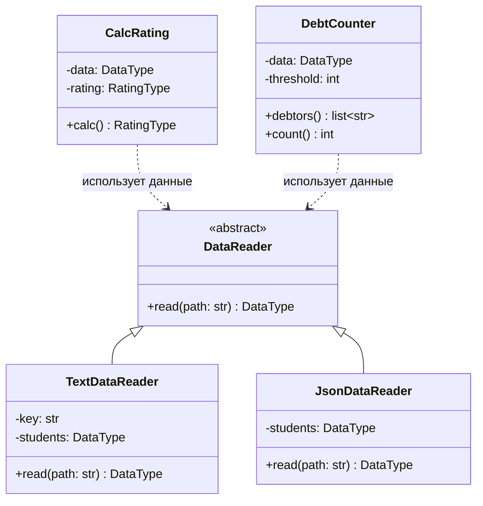

# Лабораторная работа № 1. Система контроля версий Git и CI/CD GitHub Actions

**Дисциплина:** Технологии программирования и инструментальные средства разработки систем искусственного интеллекта

**Студент:** Болотов Александр Александрович

**Вариант:** 4 (формат входных данных: JSON; расчётная процедура: подсчёт студентов с академическими задолженностями)

---

## Постановка задачи

Разработать проект на языке Python 3, который рассчитывает средний рейтинг студентов на основе данных из входного файла, и освоить работу с системой контроля версий Git и инструментом CI/CD GitHub Actions. Проект должен:

1. Использовать объектно-ориентированный подход и аннотации типов (Python Type Hints).
2. Поддерживать чтение исходных данных из текстового файла (.txt) и из файла формата JSON.
3. Рассчитывать средний рейтинг каждого студента.
4. Подсчитывать количество студентов, имеющих академические задолженности (балл < 61 хотя бы по одному предмету), и формировать их список.
5. Покрываться модульными тестами (pytest).
6. Проверяться на соответствие стандарту PEP8 (pycodestyle).
7. Автоматически тестироваться при каждом push в ветку main с помощью GitHub Actions.

## Краткое описание проекта

Входные данные - список студентов и их оценки по предметам. Чтение данных абстрагировано через базовый абстрактный класс `DataReader`, от которого наследуются конкретные читатели форматов:

- `TextDataReader` - чтение из простого текстового формата (.txt);
- `JsonDataReader` - чтение из формата JSON (индивидуальное задание, вариант 4).

Класс `CalcRating` рассчитывает средний балл каждого студента. Класс `DebtCounter` (индивидуальное задание) определяет студентов с академическими задолженностями и их количество.

### Формат входных данных

Текстовый формат (`data/data.txt`):

```
Иванов Иван Иванович
    математика:80
    программирование:90
```

JSON-формат (`data/data.json`):

```json
{
    "Иванов Иван Иванович": {
        "математика": 67,
        "литература": 100
    }
}
```

## Используемые языки, библиотеки и технологии

- **Python 3.10** - язык реализации;
- **pytest** - фреймворк модульного тестирования;
- **pycodestyle** - проверка соответствия стандарту оформления PEP8;
- **json** (стандартная библиотека) - разбор входных данных формата JSON;
- **argparse** (стандартная библиотека) - разбор аргументов командной строки;
- **Git** - распределённая система контроля версий;
- **GitHub Actions** - инструмент CI/CD для автоматического запуска линтинга и тестов.

## Структура проекта

```
rating
├── .github
│   └── workflows
│       └── github-actions-testing.yml
├── data
│   ├── data.txt
│   └── data.json
├── src
│   ├── CalcRating.py
│   ├── DataReader.py
│   ├── TextDataReader.py
│   ├── JsonDataReader.py
│   ├── DebtCounter.py
│   ├── Types.py
│   └── main.py
├── test
│   ├── test_CalcRating.py
│   ├── test_TextDataReader.py
│   ├── test_JsonDataReader.py
│   ├── test_DebtCounter.py
│   └── test_main.py
├── .gitignore
├── LICENSE
├── README.md
└── requirements.txt
```

## Запуск

Создание окружения и установка зависимостей:

```
python -m venv .venv
# Windows: .venv\Scripts\activate
# Linux/macOS: source .venv/bin/activate
pip install -r requirements.txt
```

Проверка стиля и запуск тестов:

```
pycodestyle src test
PYTHONPATH=./:./src/ pytest test
```

Запуск программы:

```
python src/main.py -p data/data.txt
python src/main.py -p data/data.json
```

## UML-диаграмма классов



## Индивидуальное задание (вариант 4)

1. **Лицензия.** В проект добавлена лицензия MIT (файл `LICENSE`).
2. **`.gitignore`.** Добавлен файл `.gitignore` для исключения служебных файлов Python.
3. **Новый читатель формата.** Класс `JsonDataReader` - наследник `DataReader`, читает данные из JSON. Покрыт тестами в `test/test_JsonDataReader.py`.
4. **Расчётная процедура.** Класс `DebtCounter` подсчитывает количество студентов с академическими задолженностями (балл < 61 хотя бы по одному предмету) и формирует их список. Покрыт тестами в `test/test_DebtCounter.py`.
5. **UML-диаграмма** классов итогового проекта приведена выше.

## Краткие ответы на теоретические вопросы

**1. Что такое системы управления версиями и их виды. Что такое Git.**
Система контроля версий (СКВ) - инструмент, который хранит историю изменений файлов и позволяет вернуться к любой версии и работать совместно. Виды: локальные (история на одном компьютере), централизованные (SVN, CVS - единый сервер с историей) и распределённые (Git, Mercurial - каждый участник хранит полную копию репозитория). Git - распределённая СКВ с быстрым ветвлением, работой офлайн и контролем целостности данных.

**2. Создание репозитория и клонирование.**
`git init` создаёт новый локальный репозиторий в текущем каталоге. `git clone <url>` клонирует существующий удалённый репозиторий вместе со всей историей на локальную машину.

**3. Запись изменений, состояния файлов и команды.**
Файл может быть неотслеживаемым (untracked), изменённым (modified), проиндексированным (staged, после `git add`) и зафиксированным (committed, после `git commit`). Основные команды: `git status`, `git add`, `git commit -m`, `git push`, `git pull`, `git log`.

**4. Типы лицензий.**
Разрешительные (MIT, BSD, Apache 2.0) - минимум ограничений, можно использовать даже в закрытых продуктах. Копилефтные (GPL, LGPL) - производные работы должны распространяться под той же лицензией. В работе выбрана MIT как простая и разрешительная.

**5. Понятия CI/CD и их роль.**
CI (непрерывная интеграция) - частое автоматическое слияние и проверка кода (сборка, тесты, линтинг) при каждом изменении. CD (непрерывная доставка/развёртывание) - автоматическая доставка проверенного кода в среду эксплуатации. Роль: раннее выявление ошибок, снижение рисков и ускорение поставки.

**6. Функции GitHub Actions.**
GitHub Actions - встроенный в GitHub инструмент автоматизации (CI/CD). Позволяет описывать сценарии (workflow) в формате YAML и запускать их по событиям (push, pull request) на виртуальных машинах: устанавливать окружение, проверять стиль, запускать тесты, собирать и публиковать артефакты.

## Выводы

В ходе работы освоены основы системы контроля версий Git (инициализация, индексация, коммиты, ветвление и слияние, работа с удалённым репозиторием), принципы CI/CD и настройка GitHub Actions для автоматического линтинга и тестирования. Реализован объектно-ориентированный проект с абстракцией чтения данных и покрытием модульными тестами. В рамках индивидуального задания (вариант 4) добавлены поддержка формата JSON и расчёт студентов с академическими задолженностями. Все тесты проходят, код соответствует стандарту PEP8, а пайплайн GitHub Actions успешно отрабатывает при каждом push в ветку main.
